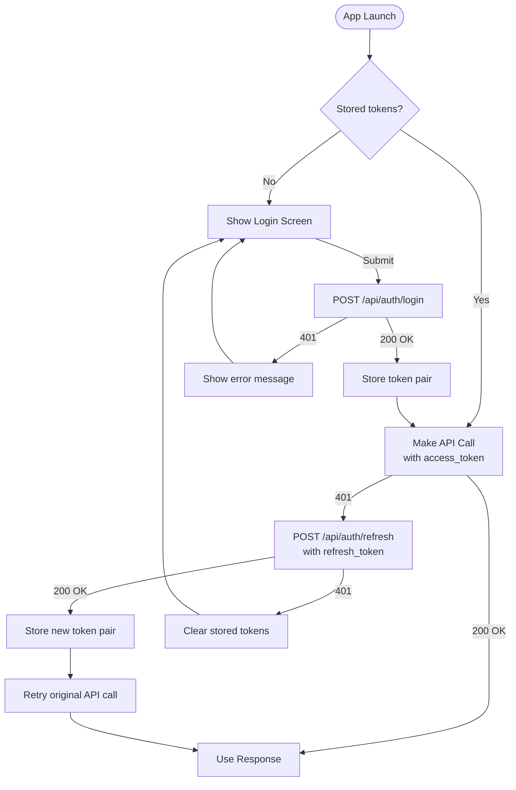

# Diagrams

All diagrams use [Mermaid](https://mermaid.js.org/) syntax and render in GitHub, VS Code (with Mermaid extension), or any Mermaid-compatible viewer.

## Diagram Index

### System Architecture

| Diagram | Location | Type |
|---|---|---|
| System context (clients → API → DB) | [features/auth/README.md](../features/auth/README.md) | `graph TB` |
| Token types overview | [features/auth/token-design.md](../features/auth/token-design.md) | `graph LR` |
| Feature dependency graph | [features/README.md](../features/README.md) | `graph TD` |

### Auth Flows

| Diagram | Location | Type |
|---|---|---|
| API registration flow | [features/auth/token-design.md](../features/auth/token-design.md) | — |
| Refresh token rotation | [features/auth/token-design.md](../features/auth/token-design.md) | `sequenceDiagram` |
| Refresh token state machine | [features/auth/token-design.md](../features/auth/token-design.md) | `stateDiagram-v2` |

### Request Flow

| Diagram | Location | Type |
|---|---|---|
| Pipeline architecture | below | `graph TD` |

## Pipeline Architecture

```mermaid
graph TD
    REQ[HTTP Request] --> EP[Endpoint<br/>Session, Parsers, Static]
    EP --> Router{Router}

    Router -->|"/", "/users/*"| BP[Browser Pipeline]
    Router -->|"/api/auth/register"<br/>"/api/auth/login"<br/>"/api/auth/refresh"| AP[API Pipeline<br/>Public]
    Router -->|"/api/*"| AAP[API Auth Pipeline<br/>Protected]
    Router -->|"/dev/*"| DP[Dev Pipeline]

    BP --> FetchUser[fetch_current_scope_for_user]
    FetchUser --> WebRoutes[Controllers & LiveViews]

    AP --> PublicAPI[Auth Controller<br/>register, login, refresh]

    AAP --> JWTPlug[ApiAuth Plug<br/>Verify Bearer JWT]
    JWTPlug --> ProtectedAPI[Protected Controllers]
```

## Mobile App Token Lifecycle


