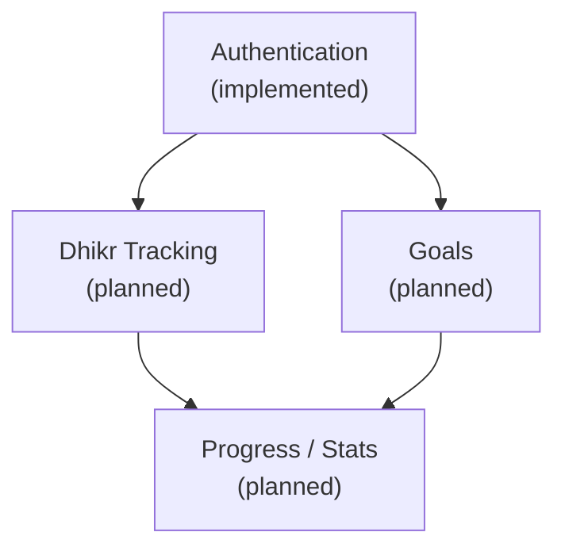

# Features

## Feature Index

| Feature | Status | Description | Doc |
|---|---|---|---|
| **Authentication** | Implemented | Dual auth (web session + API JWT/refresh tokens), user registration, login, settings | [auth/README.md](auth/README.md) |

## Feature Dependency Graph

Authentication is the foundational feature — all future features depend on knowing who the user is.

## Planned Features

These are anticipated based on the Awrad Dhikr Goals Tracker mobile app:

| Feature | Dependencies | Notes |
|---|---|---|
| Dhikr Tracking | Auth | Core feature: track daily adhkar with counters |
| Goals | Auth | Set dhikr goals (daily/weekly targets) |
| Progress / Stats | Dhikr, Goals | View streaks, completion rates, history |
| Notifications | Auth | Reminders for daily adhkar |
| Sync | Auth, Dhikr, Goals | Offline-first mobile with server sync |

> These are projections — actual features will be documented as they're built.
