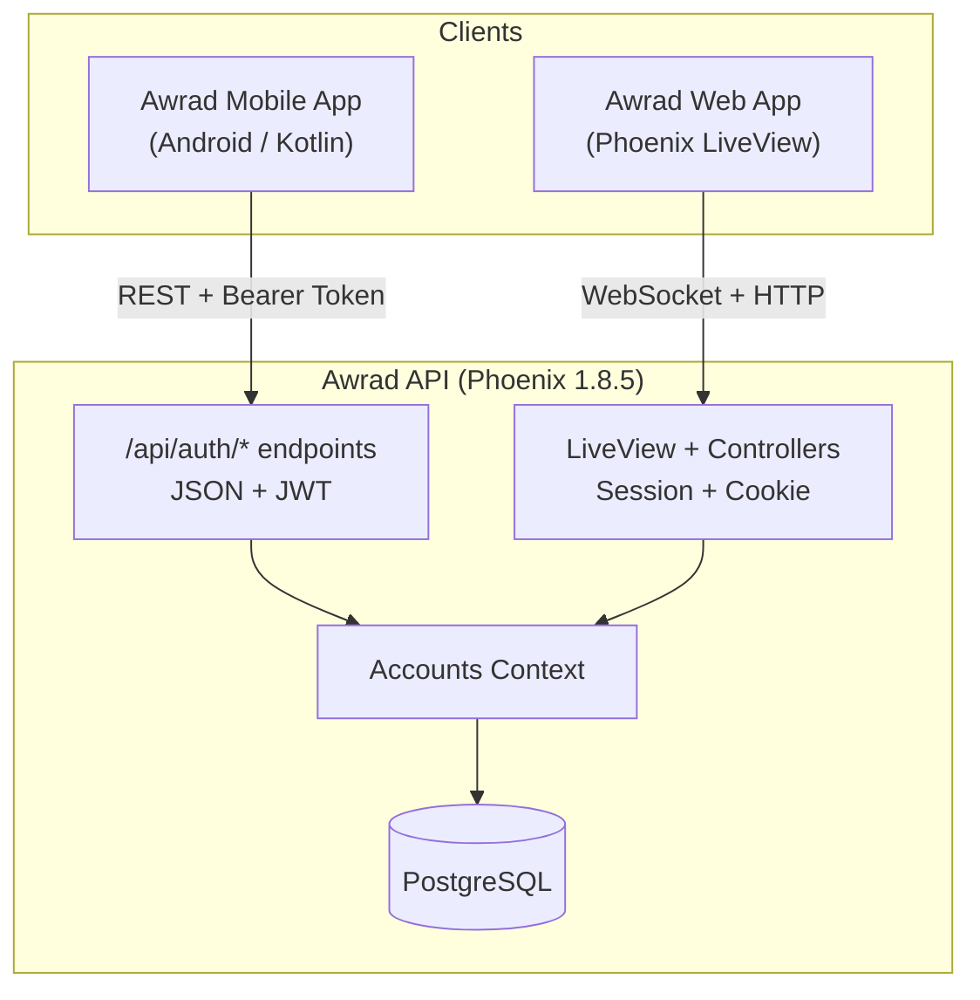

# Feature: Authentication

## Overview

The auth system provides identity management for two clients:

- **Web app** (Phoenix LiveView): session + cookie based, with magic link and password login
- **Mobile app** (Android): JWT access token + rotating refresh token over REST API

Both share a single `User` schema and `Accounts` context.

## System Context

## User Schema

| Field | Type | Notes |
|---|---|---|
| `id` | binary UUID | Primary key |
| `email` | citext | Unique, case-insensitive |
| `hashed_password` | string | Nullable (magic link users may not have one) |
| `confirmed_at` | utc_datetime | Set on first magic link confirmation |
| `authenticated_at` | utc_datetime (virtual) | Set from session token, used for sudo mode |
| `inserted_at` | utc_datetime | |
| `updated_at` | utc_datetime | |

## Sub-Features

| Feature | Description | Doc |
|---|---|---|
| Web registration | Email-based registration with optional password | Built into phx.gen.auth |
| Magic link login | Passwordless login via email link (15 min expiry) | Built into phx.gen.auth |
| Password login | Email + password login | Built into phx.gen.auth |
| Settings | Change email, set/change password | Built into phx.gen.auth |
| API registration | `POST /api/auth/register` with email + password | `auth_controller.ex` |
| API login | `POST /api/auth/login` returns token pair | `auth_controller.ex` |
| Token refresh | `POST /api/auth/refresh` with rotation | [token-design.md](token-design.md) |
| API logout | `DELETE /api/auth/logout` revokes tokens | `auth_controller.ex` |

## Password Rules

- Minimum: 12 characters
- Maximum: 72 bytes (bcrypt limit)
- Hashing: bcrypt via `bcrypt_elixir`
- Dev/test: bcrypt log_rounds = 1 (fast)

## Key Files

- `lib/awrad_api/accounts.ex` — public context API
- `lib/awrad_api/accounts/user.ex` — user schema + changesets
- `lib/awrad_api/accounts/user_token.ex` — DB token schema + queries
- `lib/awrad_api/accounts/token.ex` — JWT + refresh token logic
- `lib/awrad_api/accounts/scope.ex` — caller scope
- `lib/awrad_api/accounts/user_notifier.ex` — email templates
- `lib/awrad_api_web/user_auth.ex` — session auth plugs
- `lib/awrad_api_web/plugs/api_auth.ex` — JWT auth plug
- `lib/awrad_api_web/controllers/api/auth_controller.ex` — JSON endpoints
- `lib/awrad_api_web/controllers/user_*_controller.ex` — web controllers
- `priv/repo/migrations/*_create_users_auth_tables.exs` — migration
- `test/awrad_api/accounts_test.exs` — context tests
- `test/awrad_api_web/controllers/user_*_test.exs` — controller tests
- `test/awrad_api_web/user_auth_test.exs` — plug tests
