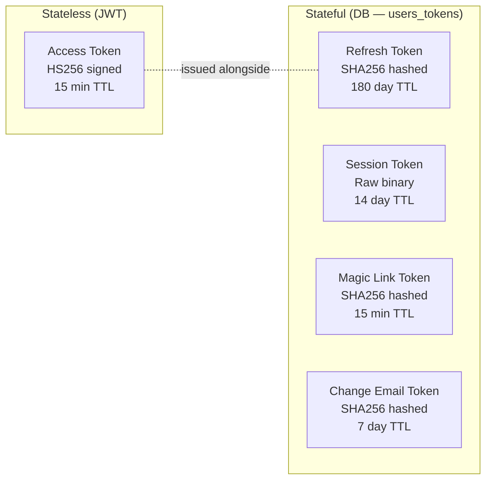
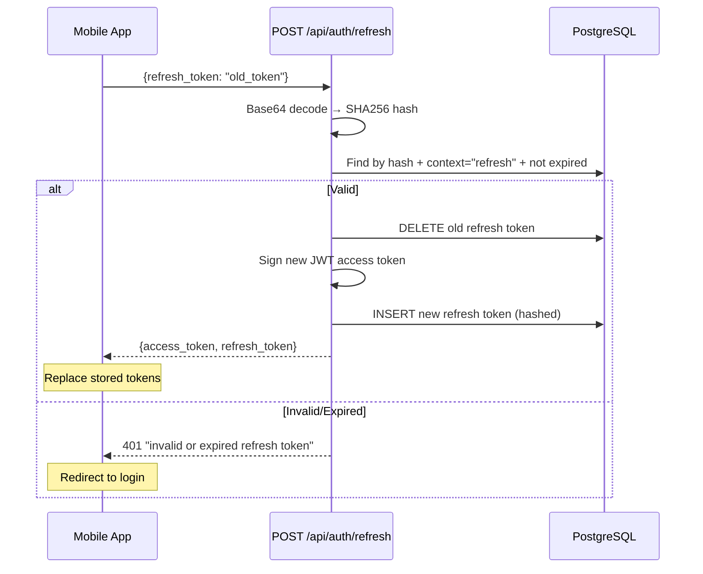
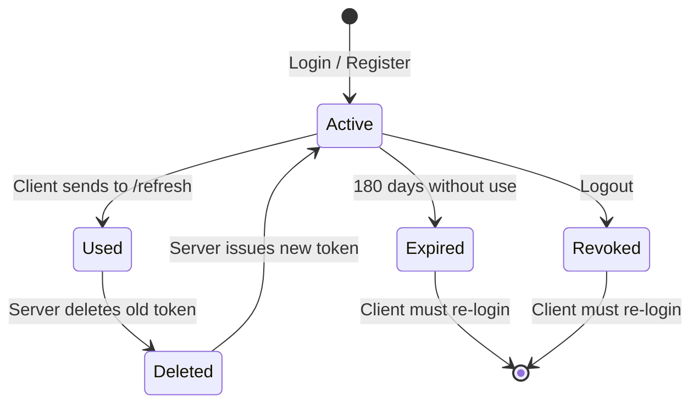

# Token Design

## Token Types



## Access Token (JWT)

| Property | Value |
|---|---|
| Module | `AwradApi.Accounts.Token` |
| Algorithm | HS256 |
| Expiry | 15 minutes |
| Issuer / Audience | `awrad_api` |
| Subject (`sub`) | User UUID |
| Library | Joken 2.6 |

**JWT Claims Example**:
```json
{
  "aud": "awrad_api",
  "exp": 1775554305,
  "iat": 1775553405,
  "iss": "awrad_api",
  "jti": "unique-id",
  "nbf": 1775553405,
  "sub": "7f566c03-74d7-43ea-bbeb-2a8a3fc0dfd5"
}
```

**Why JWT**: No DB lookup per API request. The mobile app makes frequent calls, so stateless validation keeps latency low.

**Why 15 minutes**: Short enough to limit damage if leaked, long enough to avoid constant refreshing.

## Refresh Token (DB-backed)

| Property | Value |
|---|---|
| Generation | 32 random bytes (`:crypto.strong_rand_bytes/1`) |
| Client format | Base64 URL-encoded (no padding) |
| DB storage | SHA256 hash of raw bytes |
| DB context | `"refresh"` |
| Expiry | 180 days |
| Rotation | Old token deleted on use, new one issued |

**Why DB-backed**: Long-lived tokens must be revocable (lost device, compromised account).

**Why 180 days with rotation**: Active users (daily dhikr app usage) get the clock reset on every refresh. Only truly inactive users (6+ months) need to re-login.

## Refresh Token Rotation



### Rotation State Machine



**Security benefit**: If an attacker steals a refresh token and uses it first, the legitimate user's next refresh fails (token already consumed) — signaling a breach.

## Session Token (Web)

| Property | Value |
|---|---|
| Generation | 32 random bytes |
| Storage | Raw binary in DB, signed in cookie |
| Context | `"session"` |
| Expiry | 14 days |

No hashing — session tokens are stored in a signed cookie, so they don't need the same protection as email-delivered tokens.

## Signing Secret Configuration

| Environment | Source |
|---|---|
| Dev | Hardcoded in `config/dev.exs` |
| Test | Hardcoded in `config/test.exs` |
| Prod | `JWT_SIGNING_SECRET` env var (required, set in `config/runtime.exs`) |

Generate a production secret: `mix phx.gen.secret`
